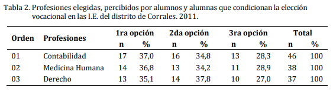
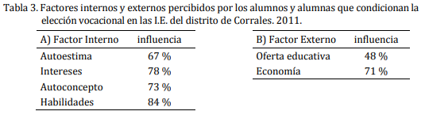
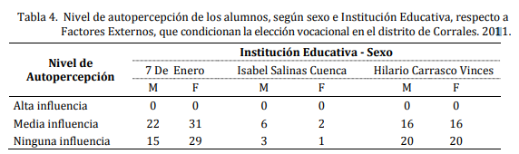

# Búsqueda de información 

Para poder trabajar con la recomendación de carreras, debemos entender como funciona uno de los test vocacional, el cuál es el más usado por las personas para identificar que estudiar o que trabajar con base en sus cualidades, personalidad, gustos, entre otros. En nuestro caso solo nos basaremos en la elección de carreras.

### Test vocacional

##### ¿Qué es?

El test vocacional permite a una persona saber qué carrera estudiar o cuál es su verdadera vocación. Se trata de una herramienta muy útil al momento de ayudar a los jóvenes a reflexionar sobre sus gustos y preferencias, valorando también sus habilidades en las distintas áreas ocupacionales.

El propósito principal del test vocacional consiste en descubrir y reflexionar sobre los intereses del estudiante, sus habilidades y las tendencias en el ambiente académico. Para ello se deben plantear diferentes interrogantes como por ejemplo cuáles son las aspiraciones del alumno, dónde quiere trabajar en el futuro, qué capacidad de adaptación tiene, a fin de ir explorando diferentes tópicos hasta encontrar la profesión que más se ajuste a su perfil.

El test vocacional le permite al orientador recabar una gran cantidad de información sobre los intereses, gustos, habilidades y aptitudes del estudiante y al mismo tiempo indagar sobre otros aspectos determinantes que facilitan el proceso de elección.

##### ¿Cómo funciona?

La prueba de orientación vocacional se tarda entre cinco y diez minutos en completarse y en ella los estudiantes observan quince conjuntos de cuatro imágenes que representan actividades laborales específicas, de las cuales solamente debes elegir la actividad que te resulte más atractiva, y aquella que te parece menos atractiva.

##### ¿Cómo se evalúa?

Esta prueba, como muchas otras, usan los códigos de Holland para dar sus respuestas. A pesar de que no es el único método para dar una respuesta, es una de las más usadas. Los códigos de Holland agrupan los intereses en seis categorías:

1. Realista: ocupaciones prácticas y al aire libre
2. Investigador: científico
3. Artístico: creativo
4. Social: asesoramiento y enseñanza
5. Emprendedor: administración y ventas
6. Convencional: oficina

Es importante aclarar que el test vocacional cumple un rol meramente orientador, esto quiere decir que no es determinante. Este tipo de recursos le proporciona al profesional a cargo de la tarea de orientación una información muy valiosa para evaluar las distintas alternativas académicas que se adaptan al perfil del estudiante, pero no tienen que ser considerados como definitivo al momento de escoger una carrera.

### Códigos de Holland

El test de Holland tiene en cuenta diferentes variables para responder con una _categoría de persona_. En este test se hacen preguntas que debes responder con tu interés o proyección personal y profesional. Pero no solo esto, también hacen preguntas de autopercepción, autoconocimiento, logros, aspiraciones y gustos, dando un resultado más certero.

Para calificar este resultado, se tienen los *tipos de Jonh Hollando*, los cuales son:

1. **El tipo realista:** La herencia y experiencias propias de la persona realista la llevan a preferir actividades que tengan que ver con
el manejo explícito, ordenado o sistemático de objetos, instrumentos, máquinas, animales y a evitar actividades
educativas o terapéuticas. 

Tiene conductas como:

a- Prefiere ocupaciones o situaciones realistas (por ejemplo, las artesanías) con las cuales pueda desarrollar
actividades de su preferencia y evitar las que demandan las ocupaciones o situaciones sociales.
b- Emplea sus habilidades realistas para resolver problemas en el trabajo y en otras situaciones.
c- Se considera a sí misma poseedora de habilidades mecánicas y atléticas y falta de habilidad para las
relaciones humanas.
d- Tiene en mayor estima las cosas concretas o las características personales tangibles: el dinero, el poder, la
posición social.

Como posee estas preferencias, habilidades, valores y opiniones sobre sí misma, la persona realista propende
a mostrarse como _poco sociable - Materialista - Retraída - Conformista - Natural - Estable - Sincera - Normal - Ahorrativa - Auténtica - Persistente - Falta de perspicacia - Masculina - Táctica - No complicada_

2. **El tipo científico o investigador:**  La herencia y experiencias propias de la persona científica la llevan a preferir actividades que tienen que ver con la investigación fundada en la observación simbólica, sistemática y creativa de los fenómenos físicos,
biológicos y culturales, para comprenderlos y controlarlos, y a un rechazo de las actividades persuasivas,
sociales y ruti narias. Estas tendencias conductuales, a su vez, llevan a adquirir habilidades científicas y matemáticas y a la
insuficiencia en cuanto a habilidades persuasivas. El desarrollo de una pauta investigadora de actividades, habilidades e intereses produce una persona predispuesta a mostrar la siguiente conducta:

a- Prefiere las ocupaciones o situaciones de investigación en que pueda desarrollar sus actividades y
habilidades preferidas y evitar las actividades que demandan las ocupaciones o situaciones comerciales.
b- Emplea sus habilidades de investigación para resolver problemas en el trabajo y en otros medios.
c- Se considera a sí misma como erudita, intelectualmente confiada en sí misma, con capacidades matemáticas
y científicas, y falta de habilidad de liderazgo.
d- Le da importancia a la ciencia

Como tiene estas preferencias, habilidades, ideas de sí mismo y valores, el individuo investigador tiende a
mostrarse como _Analítico - Introspectivo - Racional - Cauteloso - Introvertido – Reservado - Crítico - Metódico – Modesto - Curioso - Pasivo - Poco popular - Independiente - Pesimista – Intelectual - Preciso_

3. **El tipo social:** La herencia y experiencias peculiares de la persona social la conducen a preferir actividades vinculadas con el manejo de otras personas a las que pueda informar, educar, formar, curar o servir de guía, y a sentir rechazo por actividades explícitas, ordenadas y sistemáticas relacionadas con el uso de materiales, instrumentos o máquinas. Estas tendencias conductuales conducen, a su vez, a una adquisición de habilidades sociales (tales como las capacidades interpersonales y educativas) y a una insuficiencia en cuanto a las capacidades manuales y técnicas.

a. Prefiere las ocupaciones y situaciones sociales en que pueda desarrollar sus actividades y habilidades
preferidas y evitar las actividades que demandan las ocupaciones y situaciones realistas.
b. Emplea sus habilidades sociales para resolver problemas en el trabajo y en otros medios.
c. Se considera dispuesto a ayudar a otro y entenderlo; con capacidad de enseñar y falto de habilidad mecánica
y científica.
d. Aprecia actividades y problemas tanto sociales como éticos.

Tiende a ser _Influyente - Servicial – Responsable - Cooperativa - Idealista – Sociable - Femenina - Perspicaz - Discreta - Amistosa – Amable - Comprensiva - Generosa – Persuasiva_

4. **El tipo convencional:** La herencia y experiencias peculiares de la persona convencional la llevan a preferir actividades vinculadas con el manejo explícito, ordenado, sistemático de los datos, tales como llevar archivos, tomar notas, reproducir materiales, organizar datos escritos y numéricos conforme a un plan prescrito, operar maquinaria de las empresas y de procesamiento de datos para fines de organización económicos, y a rechazar las actividades ambiguas, libres, exploratorias o poco sistemáticas.

Estas tendencias conductuales, a su vez, la llevan a adquirir un sistema de capacidades propias de los
empleados, inteligencia para el cálculo y del negocio, y a padecer una deficiencia en cuanto a las habilidades
artísticas.

a. Prefiere ocupaciones o situaciones convencionales en que pueda desarrollar sus actividades preferidas y
evitar las actividades requeridas en ocupaciones o situaciones artísticas.
b. Utiliza sus habilidades convencionales para resolver problemas en el trabajo y en otras situaciones.
c. Se considera a sí misma como conformista, ordenada y con capacidad numérica y secretarial.
d. Aprecia mucho el logro en los negocios y el económico.

La persona convencional tiende a ser _Conformista - Inhibida - Mojigata - Escrupulosa – Obediente - Controlada (calmada) - Defensiva - Ordenada - Poco imaginativa - Eficiente - Persistente - Inflexible – Práctica_

5. **El tipo emprendedor:** La herencia y experiencia peculiares de la persona emprendedora la llevan a preferir actividades vinculadas con el manejo de otras personas, para lograr fines organizativos o beneficios económicos, así como a tener un rechazo por las actividades de observación, simbólicas y sistemáticas. 

Estas tendencias conductuales la conducen, a su vez, a adquirir habilidades de líder, interpersonales y persuasivas, lo mismo que a una insuficiencia por cuanto a las habilidades científicas.

a. Prefiere ocupaciones o situaciones arriesgadas en las que pueda desarrollar sus actividades preferidas y
evitar las actividades que demandan las ocupaciones o situaciones científicas.
b. Emplea sus habilidades de emprendedoras, para resolver problemas en el trabajo y en otras situaciones.
c. Se considera a sí misma agresiva, popular, confiada en sí misma, sociable, con capacidades de líder y
facilidad de palabra, y desprovista de capacidad científica.
d. Aprecia los logros políticos y económicos.

La persona emprendedora tiende a ser _Adquisitiva - Dominante – Optimista - Aventurera - Enérgica – Hedonista - Ambiciosa - Exhibicionista - Confiada en sí misma - Discutidora - Engreída – Sociable - Confiable – Impulsiva - Locuaz_

6. **El tipo artístico:** La herencia y experiencia peculiares de la persona artística le hacen preferir actividades ambiguas, libres, desorganizadas, vinculadas al manejo de materiales físicos, verbales o humanos, para crear formas o productos artísticos, y a despertarle un rechazo por las actividades explícitas, sistemáticas y ordenadas.

Estas tendencias conductuales llevan, a su vez, a una adquisición de habilidades artísticas – lenguaje, arte,
música, teatro, literatura – y a una insuficiencia relativa a las habilidades de empleado o de las requeridas en los
negocios. 

a. Prefiere ocupaciones o situaciones artísticas en las que pueda desarrollar actividades requeridas en las
ocupaciones o situaciones convencionales.
b. Utiliza su capacidad artística para resolver problemas en el trabajo y en otros medios.
c. Se considera a sí mismo como expresivo, original, intuitivo, femenino, no conformista, introspectivo,
independiente, desordenado y con capacidad artística y musical (actuación, literatura, conversación).
d. Aprecia las cualidades estéticas.

Como tiene estas preferencias, valores, habilidades e ideas de sí misma, la persona artística tiende a
mostrarse como _Complicada - Imaginativa – Intuitiva - Desordenada - Poco práctica - No conformista - Emocional – Impulsiva - Original - Femenina - Independiente - Idealista - Introspectiva_ 

**Esta prueba se encuentra adjunta en la carpeta de este mismo documento.**

### Investigación 

En una investigación realizada en el año 2011 donde se realizó un test vocacional a diferentes estudiantes de grado 11, se analizaron 3 variables que expuestas por los estudiantes a la hora de realizar el test. Estas fueron la *elección vocacional*, *factores internos* y *externos* que influyeron en la decisión de la carrera elegida por los estudiantes.

Como se puede observar, los alumnos(as) eligieron preferentemente la Carrera de Contabilidad, en primera segunda y tercera opción, con 32,6%, 41,3% y 26,1%, respectivamente; siguen en orden de prioridad: Medicina Humana (36,8%) y Derecho (32,6%). Los resultados obtenidos por los estudiantes no son de nuestro interés en este punto, pero a continuación se expondrá los factores internos y externos que influenciaron a la hora de esas decisiones.

Para los estudiantes, los factores internos que influyeron en la decisión de la vocación son a) las habilidades: aptitud innata, talento, destreza o capacidad que ostenta una persona para llevar a cabo y con éxito, determinada actividad, trabajo u oficio, con 84%; b) los intereses: inclinación o preferencia que manifiesta una persona por algo especifico, con 78%; c) el autoconcepto: concepto que tenemos de nosotros mismos, con 73%, y d) la autoestima: fuerza innata que impulsa al organismo hacia la vida, hacia la ejecución armónica de todas sus funciones y hacia su desarrollo, con 67%.

Ahora, los factores externos que influyeron para esta misma decisión son a) la economía: satisfacción de las necesidades humanas mediante bienes con 71%, y b) la oferta educativa: entidades públicas y privadas que ofrecen un servicio educativo con 48%. Otros factores que se presentaron en menor proporción fueron la: cultura, información y habilidades que posee el ser humano; el medio social, entorno donde se puede conocer a la gente y socializar; la familia, conjunto de personas de la misma sangre, de la misma casa y la demanda laboral, ámbito donde se ponen en contacto los compradores y vendedores de un determinado bien, quienes realizan las funciones de la oferta y la demanda de bienes y servicios, a decir de los alumnos(as) o determinantes en la elección vocacional, fueron referidas en poca proporción.

En cuanto al nivel de autopercepción de los factores externos, la influencia es mediana (51,38%) y ninguna (48,62%) en la orientación vocacional. No se registró ningún caso de alta influencia.

**Esta investigación se encuentra en la misma carpeta de este documento.**

### Resultado de la conceptualización

Como podemos notar, este artículo nos presenta las variables más influyentes a la hora de tomar la decisión vocacional. Estas variables pueden ser útiles en la implementación del sistema experto con el mismo fin, ya que, de esta forma, daremos un resultados más arraigado a la realidad con respecto a la decisión de estudiar una carrera.

Como resultado de esta búsqueda, tenemos que el sistema experto trabajará con _habilidades, debilidades, aptitudes, talento, intereses/gustos y economía_ como variables que ingresará el usuario para obtener su respuesta. Claramente, se deberá tener la información de la persona, como el nombre, con el que guardaremos su registro y retornaremos las posibles carreras.

Por este cambio en las variables, la intefaz gráfica también debe ser actualizada. Ahora contendrá una ventana donde el usuario ingresará su información personal (nombre, apellido, edad, correo). Luego, se mostrará otra ventana donde habrá un botón desplegable que contenga las carreras disponibles en el momento con su precio, una lista de checkboxes para habilidades, debilidades y aptitudes del usuario, y un último input para el o los talentos del usuario. Las carreras que se van a usar son Ingeniería en sistema, Diseño de medios interactivos, Mercadeo internacional, Finanzas, Derecho y Psicología. Todas estas carreras son tomadas de la universidad ICESI.

#### Bibliografía

1. https://elcomercio.pe/respuestas/como como-le-sirven-los-test-vocacionales-a-los-jovenes-test-de-psicologia-tdex-revtli-noticia/
2. https://www.indeed.com/orientacion-profesional/desarrollo-profesional/test-orientacion-vocacional