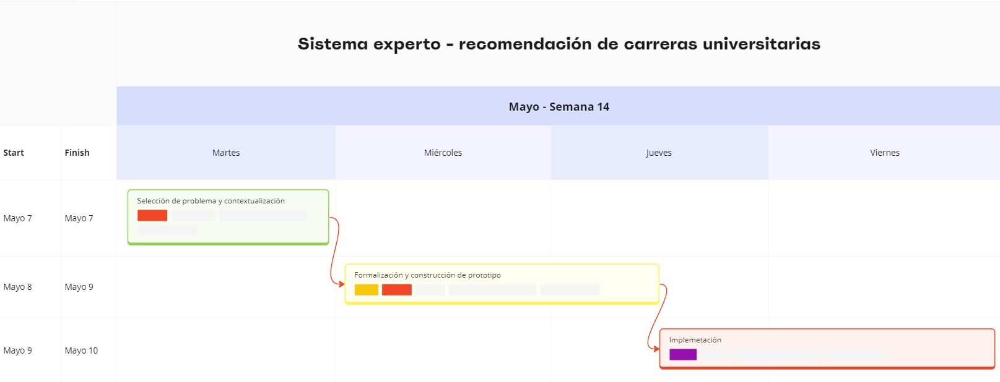

# Definición del problema

### Identificación del problema

Desarrollar un sistema experto que pueda recomendarle una carrera universitaria a un usuario específico. Este sistema experto debe permitir recibir los datos del usuario que serán cruciales para la elección de su carrera, como lo son sus habilidades, debilidades, gustos, dinero, materias de interés,
entre otras. 

El problema recae en el desarrollo sistema experto, puesto que debe tener una base de conocimiento de las carreras (precios y pensul), gustos relacionados con ciencias o arte, habilidades y debilidades (sus relaciones a diferentes carreras). Además, tener una interfaz gráfica donde el usuario pueda interactuar (ingresando los datos requeridos) con el sistema experto. Con estos datos, el sistema experto debe seguir las reglas y asociaciones estipuladas para retornar la o las carreras más aptas con los datos ingresados por el usuario.

Este sistema debe ser intuitivo y fácil de usar para el usuario. La interfaz gráfica, primero mostrará un input donde el usuario digite su nombre. Luego, se mostrará otra ventana donde habrá un botón desplegable que contenga las carreras disponibles en el momento con su precio, una lista de checkboxes para habilidades y debilidades del usuario, y un último input para los gustos del usuario.  

### Competencias de los usuario

Los usuarios finales deben tener unas competencias básicas para poder utilizar el sistema experto, tales como: habilidades básicas en computación, tener la capacidad de propocionar información relevante y resumida de los temas necesarios, habilidades de lectura y de tomas de decisiones. 

### Viabilidad y recursos

El desarrollo de este sistema experto puede resultar muy útil para los usuarios ya que se volvería una guía personalizada y viable a la hora de elegir una carrera. También sería más fácil, rápido y accesible para los usuarios, un sistema experto en línea, envés de tener que buscar un asesor vocacional para poder elegir una carrera. Finalmente, este sistema experto podría tener una base de conocimiento mucho más amplia y actualizada, permitiendo así, que los usuarios tomen las mejores decisiones.

Los recursos que usaría este sistema experto incluyen:
1. Personal vocacional, desarrolladores y usuarios beta.
2. Tiempo para planeación, recopilación de información, desarrollo, pruebas y despliegue.
3. Dinero para el personal, para las herramientas a usar (Software y Hardware) y para el mantenimiento.
4. Herramientas como entornos de desarrollo, equipos de computo para el desarrollo y servidores para el alojamiento del sistema.

### Restricciones

El sistema experto debe recibir al menos 4 características, de las mencionadas anteriormente, para poder retornar una respuesta aceptable.

El sistema experto debe tener una base de conocimiento actualizada con respecto a las carreras universitarias, tanto nuevas como existentes para no retornar datos innexistentes o antiguos.

### Cronograma de tareas

### Diseño preliminar y requisitos del alto nivel:

De manera preliminar y los requisitos que debe cumplir, el sistema experto debe estar en la capacidad de recirbir los datos de los usuario sobre los temas especificados. Además, debe usar las datos de los usuarios en el algoritmo de recomendación para buscar y seleccionar las carreras que se alineen más con los atributos del usuario. Seguidamente, presentar la lista de las posibles carreras a elegir y sus motivos. La interacción del usuario con el sistema experto, debe ser a través de una interfaz gráfica.